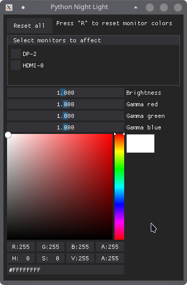

# pynightlight

##Hastily created "night light" app with python.

###**Linux only, requires xrandr.**

---
_Installation:_

1. Install pipx (recommendation only)

2. `pipx install git+https://github.com/Kamaleen0/pynightlight`

If not using pipx
* `pip install --user git+https://github.com/Kamaleen0/pynightlight`
---

